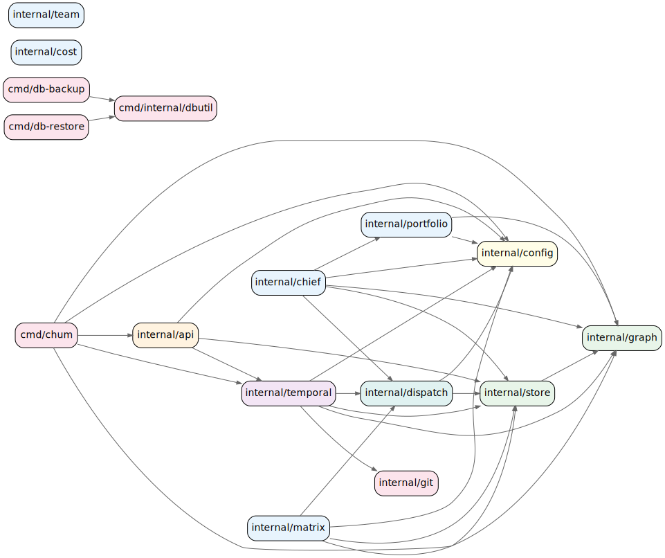

# CHUM Package Map

> Auto-generated from dependency analysis. Regenerate with:
> ```bash
> bash scripts/gen-dep-graph.sh | dot -Tsvg -o docs/deps/package-deps.svg
> ```

---

## Package Dependency Graph



---

## Coupling Metrics

### Fan-out (what each package depends on)

| Package | LOC | Fan-out | Internal Dependencies |
|---|---|---|---|
| `cmd/chum` | — | 5 | api, config, graph, store, temporal |
| `internal/temporal` | 9,721 | 5 | config, dispatch, git, graph, store |
| `internal/chief` ⚠️ | 1,818 | 5 | config, dispatch, graph, portfolio, store |
| `internal/matrix` ⚠️ | 2,437 | 4 | config, dispatch, graph, store |
| `internal/api` | 2,050 | 3 | config, store, temporal |
| `internal/dispatch` | 3,440 | 2 | config, store |
| `internal/portfolio` | 497 | 2 | config, graph |
| `internal/store` | 9,222 | 1 | graph |
| `internal/config` | 3,937 | 0 | — |
| `internal/graph` | 3,488 | 0 | — |
| `internal/git` | 1,619 | 0 | — |
| `internal/cost` ⚠️ | 264 | 0 | — |
| `internal/team` ⚠️ | 374 | 0 | — |

> ⚠️ = **Not imported by any package.** These packages are implemented but not yet wired into the system. See [Dead Packages](#dead-packages) below.

### Fan-in (how many packages depend on each)

| Package | Fan-in | Depended on by |
|---|---|---|
| `internal/config` | 7 | cmd/chum, api, chief, dispatch, matrix, portfolio, temporal |
| `internal/graph` | 6 | cmd/chum, chief, matrix, portfolio, store, temporal |
| `internal/store` | 6 | cmd/chum, api, chief, dispatch, matrix, temporal |
| `internal/dispatch` | 3 | chief, matrix, temporal |
| `internal/temporal` | 2 | cmd/chum, api |
| `internal/git` | 1 | temporal |
| `internal/portfolio` | 1 | chief |
| `internal/api` | 1 | cmd/chum |

---

## Package Responsibilities

### Core Engine

| Package | Responsibility |
|---|---|
| `internal/temporal` | Temporal workflow definitions, activities, agent CLI builders, output parsers, worker bootstrap |
| `internal/store` | SQLite persistence — dispatches, claims, stages, metrics, health events, safety blocks |
| `internal/graph` | Low-level DAG engine (morsels) — schema, queries, FTS5 |
| `internal/config` | TOML configuration with SIGHUP hot-reload |
| `internal/dispatch` | Agent dispatch, rate limiting, Docker container management |
| `internal/git` | Git operations, worktree management, DoD post-merge checks |
| `internal/api` | HTTP API server (:8900) — dispatch triggers, status endpoints |

### Dead Packages

These packages are implemented but have **zero imports** anywhere in the codebase:

| Package | Intended Purpose | Status |
|---|---|---|
| `internal/chief` | Multi-team sprint planning, budget allocation | Built but never wired in |
| `internal/matrix` | Matrix.org chat integration, message polling | Built but never wired in |
| `internal/team` | Auto-spawning OpenClaw agent teams | Built but never wired in |
| `internal/cost` | LLM token counting and cost estimation | Built but never wired in |

---

## Architectural Layers

```
┌─────────────────────────────────────────────┐
│  cmd/chum (entry point)                     │
├─────────────────────────────────────────────┤
│  internal/api (HTTP)                        │
├─────────────────────────────────────────────┤
│  internal/temporal (workflows + activities) │
│     ├── dispatch (agent execution)          │
│     ├── git (worktrees + merge)             │
│     └── portfolio (multi-project)           │
├─────────────────────────────────────────────┤
│  internal/store (SQLite persistence)        │
│     └── graph (DAG engine)                  │
├─────────────────────────────────────────────┤
│  internal/config (TOML + hot reload)        │
└─────────────────────────────────────────────┘
```

---

## Known Issues

1. **`temporal` is a god package** (9,721 LOC, fan-out 5) — should be split into `temporal/` (workflows), `activity/` (activities), `agent/` (CLI + parsers)
2. **4 dead packages** (`chief`, `matrix`, `team`, `cost`) — need to be wired in or removed
3. **`store` has high fan-in (6)** — consumers depend on concrete types; extracting interfaces would improve testability
