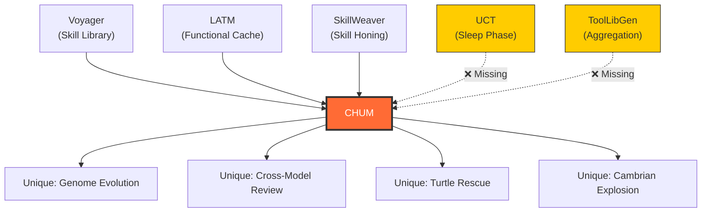

# CHUM vs Academic SOTA: Deep Comparison

> Analysis of CHUM's existing architecture against the frameworks described in
> [The Crystallization of Intelligence](file:///home/ubuntu/projects/cortex-chum-test/docs/deep-research.md) —
> Voyager, LATM, ToolLibGen, ToolMaker, AWM, SkillWeaver, and UCT.

---

## 1. Concept Mapping — What CHUM already does

| Academic Concept | Framework | CHUM Equivalent | Status |
|:---|:---|:---|:---|
| **Skill crystallization** | Voyager, LATM | `CalcifyPatternActivity` → `.shadow` scripts | ✅ Built |
| **Functional cache** | LATM | Calcified scripts bypass LLM entirely | ✅ Built |
| **Environmental verification** | Voyager | DoD checks (`go test`, `go vet`, `golangci-lint`, `semgrep`) | ✅ Built |
| **Antibody/pattern memory** | Voyager (Skill Library) | Genome DNA/antibodies + FTS5 lessons table | ✅ Built |
| **Tool Maker / Tool User split** | LATM | Cambrian Explosion (premium explores) → fast tier executes known | ✅ Built |
| **Multi-agent deliberation** | AWM/SkillWeaver | Turtle ceremonies (3-agent explore → deliberate → converge → emit) | ✅ Built |
| **Institutional memory** | AWM (offline) | `CLAUDE.md` synthesis from accumulated lessons | ✅ Built |
| **Deterministic enforcement** | Voyager (verified scripts) | Semgrep rules auto-generated from learner, enforced in DoD | ✅ Just wired |
| **Rule validation** | SkillWeaver (Skill Honing) | `semgrep --validate` before accepting LLM-generated rules | ✅ Just wired |
| **Beached → investigation** | — | Turtle rescue for failed tasks | ✅ Just wired |

**Bottom line:** CHUM independently arrived at ~70% of the academic SOTA. The core loop
(learn → crystallize → enforce → evolve) maps directly to Voyager's skill library +
LATM's functional cache + SkillWeaver's skill honing pipeline.

---

## 2. The Gaps — What CHUM is missing

### 🔴 Gap 1: Sleep Phase / Evolution Function (from UCT)

**The problem:** CHUM accumulates lessons, Semgrep rules, genome antibodies, and `.shadow`
scripts indefinitely. There is no offline consolidation pass.

**What UCT does:** A dedicated offline "Evolution Function" runs during non-active periods:
- **Merges** functionally similar tools into generalized versions
- **Prunes** tools with high failure rates or low usage
- **Discards** deprecated/stale scripts

**CHUM impact:** Currently 9 Semgrep rules, but at scale this will bloat. The FTS5 lessons
table will accumulate duplicate-adjacent entries. Genome antibodies will pile up per-species
without consolidation.

**Proposed fix — `PaleontologistConsolidationActivity`:**
- Runs on the existing Paleontologist schedule (daily)
- Groups Semgrep rules by embedding similarity → merge redundant ones
- Prunes lessons with low retrieval frequency (add a `hit_count` column)
- Consolidate genome antibodies that reference the same failure patterns
- Delete `.shadow` scripts that have been superseded by active scripts

> [!IMPORTANT]
> This is the **#1 priority gap**. Without it, CHUM's immune system becomes autoimmune —
> too many rules, too many antibodies, retrieval accuracy degrades.

---

### 🟡 Gap 2: Calcified Script Dispatch (from LATM's Functional Cache)

**The problem:** CHUM's calcification creates `.shadow` scripts but the dispatcher doesn't
check for active calcified scripts *before* spending tokens on LLM inference.

**What LATM does:** Before invoking the expensive Tool Maker, the system checks the
Functional Cache. If a matching tool exists, the lightweight Operator just runs it.

**CHUM's current flow:**
```
Dispatcher → ChumAgentWorkflow → Plan → Execute (LLM) → Review → DoD
```

**Proposed flow:**
```
Dispatcher → Check calcified_scripts for active match
  ├─ HIT  → Run script directly (zero tokens) → DoD verify → Done
  └─ MISS → ChumAgentWorkflow → Plan → Execute (LLM) → Review → DoD
```

**Implementation:** Add a pre-check in `ScanCandidatesActivity` or at the start of
`ChumAgentWorkflow` that queries `GetActiveScriptForType(morselType)`. If a script exists,
skip LLM entirely and run the script. This is the **stochastic→deterministic migration**
in action — the check exists conceptually but isn't wired into the dispatch fast-path.

---

### 🟡 Gap 3: Compositional Skills (from Voyager)

**The problem:** CHUM's calcified scripts are standalone. They can't call other scripts.

**What Voyager does:** Crafting a diamond pickaxe calls `mine_iron()`, which calls
`craft_iron_pickaxe()`, which calls `mine_diamond()`. Skills compose hierarchically.

**CHUM equivalent:** A calcified "add-API-endpoint" script should be able to invoke a
calcified "run-tests" subscript and a calcified "update-docs" subscript.

**Proposed fix:** Add a `depends_on` field to the `calcified_scripts` table. When a script
runs, it checks for and invokes dependencies first. This mirrors the DAG dependency system
already used for morsels.

---

### 🟢 Gap 4: Skill Honing with Varied Inputs (from SkillWeaver)

**The problem:** Calcified `.shadow` scripts are tested once (when created) but never
stress-tested with varied inputs before promotion to `active`.

**What SkillWeaver does:** After synthesizing a skill API, it auto-generates diverse test
cases with varying parameters and runs them against the live environment. Only APIs that
survive all test cases are committed.

**CHUM's current calcification flow:**
```
Shadow script created → human promotes → active
```

**Proposed flow:**
```
Shadow script created → auto-generate 3-5 varied morsel inputs →
run shadow against each → if all pass DoD → auto-promote to active
```

**Implementation:** Add a `HoneCalcifiedScriptActivity` that generates test cases using a
fast LLM, runs the shadow script in a worktree against each, and auto-promotes if all pass.

---

### 🟢 Gap 5: Embedding-Indexed Skill Retrieval (from Voyager)

**The problem:** CHUM uses FTS5 text search for lesson retrieval. This works for exact
keyword matches but misses semantic similarity.

**What Voyager does:** Skills are indexed by embedding vectors. When a new task arrives,
the system retrieves the top-k most semantically similar skills.

**CHUM improvement:** Add an embedding column to the lessons table (or a separate
vector store). Use the embedding to find semantically related lessons/antibodies even
when the exact keywords don't match. This would improve bug priming accuracy significantly.

**Priority:** Low. FTS5 is working well enough for now. Revisit when the lessons table
exceeds ~500 entries.

---

## 3. Architecture Comparison Table

| Dimension | Voyager | LATM | ToolLibGen | UCT | **CHUM** |
|:---|:---|:---|:---|:---|:---|
| **Domain** | Minecraft | Math/Logic | Reasoning Q&A | Multi-modal | **Software Engineering** |
| **Verification** | Game engine | Unit tests | Reviewer agent | Execution logs | **DoD pipeline (build/test/lint/semgrep)** |
| **Skill Storage** | Embedding-indexed JS | Python functions | Python classes | Tool assets | **SQLite + .shadow scripts + .semgrep rules** |
| **Consolidation** | Manual | None | Hierarchical clustering | Evolution Function | **❌ Missing (proposed: Paleontologist)** |
| **Compositionality** | Full (skills call skills) | Partial | Full (class methods) | Partial | **❌ Missing (proposed: depends_on)** |
| **Multi-agent** | Single | Maker/User split | Code Agent + Reviewer | Single | **Full (Shark/Turtle/Explosion/Sentinel/Learner)** |
| **Cost optimization** | N/A | Primary goal | Secondary | Secondary | **Tier escalation + calcification** |
| **Failure learning** | Retry loop | None | None | Log analysis | **Antibodies + failure learner + turtle rescue** |
| **Memory persistence** | Code files | Python cache | API schemas | Offline store | **SQLite FTS5 + CLAUDE.md + genome DNA** |

---

## 4. What CHUM does that NONE of them do

CHUM has several innovations not found in the academic literature:

### 4.1 Biological Evolution Metaphor (Genome/Species/DNA/Antibodies)
No academic framework tracks *species-level* evolutionary data. CHUM classifies each task
into a species, tracks successful patterns as DNA and failures as antibodies, and uses this
to drive future dispatch decisions. Voyager's skill library is flat; CHUM's is phylogenetic.

### 4.2 Cross-Model Review Loop (Handoffs)
Academic frameworks use a single model or at most a maker/user split. CHUM's execute→review
loop swaps the executor and reviewer agents when review fails, creating adversarial
pressure that no other system implements.

### 4.3 Beached Shark → Turtle Rescue
No academic framework has a "failed task → multi-agent investigation → decompose into
new tasks" pipeline. UCT prunes failed tools; CHUM tries to understand *why* they failed
and generates better replacements.

### 4.4 Cambrian Explosion
Parallel multi-provider execution with winner scoring. The closest academic analog is
SkillWeaver's multi-proposal exploration, but CHUM does it at the full execution level
(parallel complete implementations, not just plans).

### 4.5 Circuit Breaker (Panic Cooldown)
None of the academic frameworks have project-level health monitoring that throttles dispatch
when failure rates spike. CHUM does.

---

## 5. Prioritized Roadmap — Ideas to Steal

| Priority | Idea | Source | Effort | Impact |
|:---|:---|:---|:---|:---|
| **P0** | Sleep Phase consolidation | UCT | Medium | Prevents autoimmune bloat |
| **P0** | Calcified script fast-path dispatch | LATM | Small | Zero-token execution for known patterns |
| **P1** | Skill Honing (auto-test shadow scripts) | SkillWeaver | Medium | Auto-promotes reliable scripts |
| **P1** | Compositional scripts (depends_on) | Voyager | Small | Scripts can call subscripts |
| **P2** | Embedding-indexed lesson retrieval | Voyager | Medium | Better semantic search for bug priming |
| **P2** | Hierarchical rule aggregation | ToolLibGen | Medium | Merge similar Semgrep rules |
| **P3** | Docker-isolated script execution | ToolMaker | Large | Safer sandbox for calcified scripts |

---

## 6. The Big Picture

CHUM is essentially a **domain-specific implementation** of the entire academic stack,
applied to software engineering rather than Minecraft, math, or web navigation:



The two critical missing pieces are **consolidation** (UCT's sleep phase) and **fast-path
dispatch** (LATM's functional cache check before LLM invocation). Both are implementable
within the existing architecture — the Paleontologist schedule already provides the cron
hook for consolidation, and `GetActiveScriptForType` already exists in the store.
